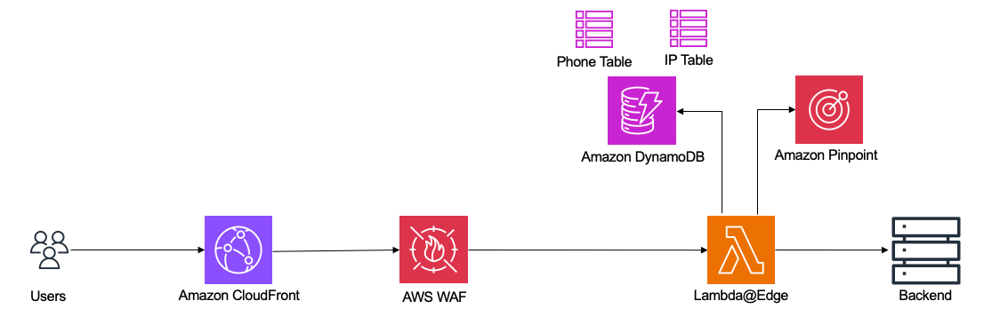
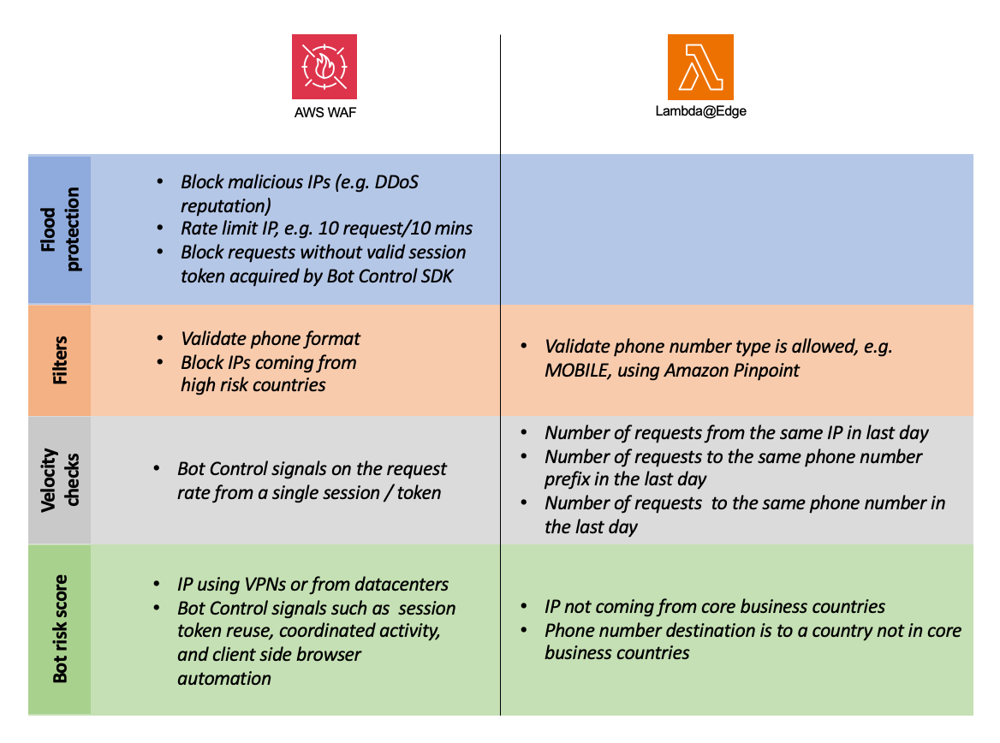

# Techniques to mitigate SMS pumping threats using AWS

I created this example solution to illustrate the different techniques you can implement using AWS services to mitigate SMS pumping threats. Common techniques used to detect and stop SMS pumping attacks include detecting automated bot traffic, implementing multiple layers of velocity checks, and applying filters. 

The example solution is a static HTML hosted on S3, allowing users to make an API call, using a Lambda behind API Gateway, to generate an OTP. The Lambda does not actually generate any OTP in the example, it is just used to showcase the mitigations. Both static and dynamic traffic is served using a CloudFront distribution, protected with an AWS WAF WebACL. The CloudFront distribution is configured with a cache behavior specific to the API, to trigger a Lambda@Edge function responsible of additional detection logic. The Lambda@Edge makes calls to other AWS services (e.g. DynamoDB, and Pinpoint) to enrich the SMS pumping detection logic. In a real world implementation, this logic can be moved to the backend. 



## List of mitigation techniques



## Deployment steps

It's mandatory to deploy the stack in us-east-1 region:

```
git clone https://github.com/achrafsouk/sms-pumping.git
cd sms-pumping
npm install
cdk deploy
```
