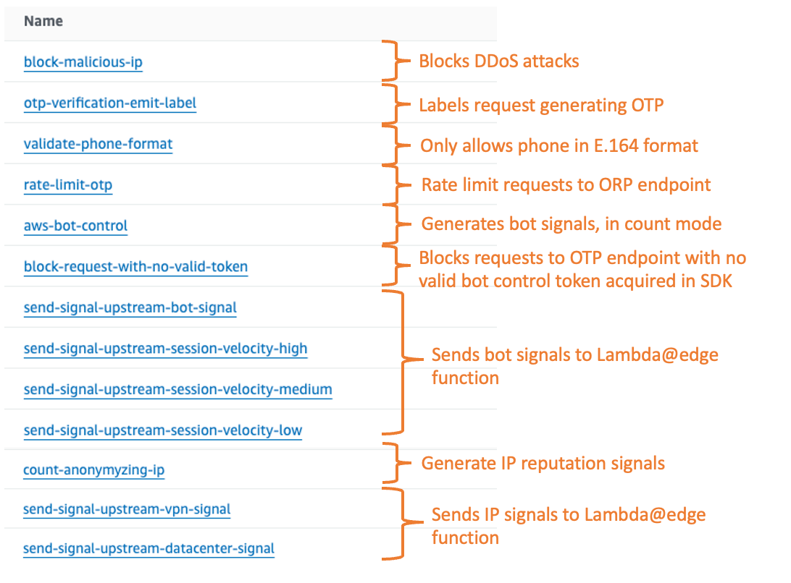

# Mitigation techniques for SMS pumping threats

This is an example that illustrate the different custom mitigations techniques for managing SMS pumping threats using AWS services. At high level, techniques include bot detection, velocity checks, and filter rules. The flow of a request to an OTP generation endpoint is the following:

## First layer of detection and mitigation using AWS WAF

When the request is received by CloudFront, AWS WAF evaluate different types of rules:
* Some will protect the endpoint against floods and DDoS attacks
* Some will generate signals, e.g. using Bot Control and IP reputation, that will be used later on for mitigation logic.
* Some will validate the requests to the endpoint, e.g. expected phone format in the input.

## Second layer of detection and mitigation using Lambda@Edge

When the request is received by Lambda@Edge, it will apply the following types of checks:
* Apply some filtering rules, e.g. validating if phone country is allowed using [Amazon Pinpoint](https://docs.aws.amazon.com/pinpoint/latest/developerguide/validate-phone-numbers.html)
* Apply some velocity checks on a large time window, e.g. how many attempts were made from the same IP in the last 24 hours? to the same number? to the same number prefix? To do that, attempt information is stored and queried in DynamoDB tables.
* Apply some filtering based on calculated risk scores, based on different threat signals

  
