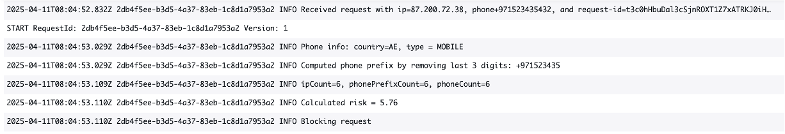

# Techniques to mitigate SMS pumping threats using AWS

We created this example solution to illustrate the different techniques you can implement using AWS services to mitigate SMS pumping threats. Common techniques used to detect and stop SMS pumping attacks include detecting automated bot traffic, implementing multiple layers of velocity checks, and applying filters. 

The example solution is a static HTML hosted on S3, allowing users to make an API call, using a Lambda behind API Gateway, to generate an OTP. The Lambda does not actually generate any OTP in the example, it is just used to showcase the mitigations. Both static and dynamic traffic is served using a CloudFront distribution, protected with an AWS WAF WebACL. The CloudFront distribution is configured with a cache behavior specific to the API, to trigger a Lambda@Edge function responsible of additional detection logic. The Lambda@Edge makes calls to other AWS services (e.g. DynamoDB, and Pinpoint) to enrich the SMS pumping detection logic. In a real world implementation, this logic can be moved to the backend. 


## List of mitigation techniques


## Deployment steps

It's mandatory to deploy the stack in us-east-1 region:

```
git clone https://github.com/achrafsouk/sms-pumping.git
cd sms-pumping
npm install
cdk deploy
```
At this stage, the code is experimental, and still being tested and worked on. It's not intented to be a production ready code, but rather to explain the different mitigation techniques through an example.

## In-depth technical information

* **[AWS WAF]** We used multiple rules to mitigate DDoS attacks on the API, before the Lambda@Edge is even triggered. This is important especially that Pinpoint API has a 20 RPS limit.
* **[AWS WAF]** Phone is validated against E.164 format.
* **[AWS WAF]** A label is generated when requests match the API path, so it can be used to limit the scope of some subsequent rules, such as the low rate limit, to the OTP workflow.
* **[AWS WAF]** We used signals from the Anonymous IP List managed rule, to detect IPs coming from VPNs and datacenters, contributing to the risk score calculation in Lambda@Edge. You can use other effective similar rules such as [Anonymous IP Advanced Protection by GeoGuard](https://aws.amazon.com/marketplace/pp/prodview-j4k2eobt6aaf6)
).
* **[AWS WAF]** Detected signals in AWS WAF are sent up streams to Lambda@Edge using request headers.
* **[Lambda@Edge]** You can control the desired log level  in Lambda@Edge using ```LOG_LEVEL``` parameter.

* **[Lambda@Edge]** You can configure which level with threat triggers a block using ```THREAT_BLOCK_THRESHOLDS``` parameter. For example, you can keep the logic in count mode.
* **[Lambda@Edge]** Calls to DynamoDB and Pinpoint are wrapped with a timer, and managed gracefully, to avoid impacting the API latency. This can be configured.
* **[DynamoDB]** Calls to DynamoDB are done in parallel, with the assumption of accepted eventual consistency.
* **[DynamoDB]** Items are created in DynamoDB tables with a configurable TTL of 1 week, afterwhich they are deleted to save storage cost.

Customize the following paramters to adapt it to your business and risk appetite:
* **[AWS WAF]** Rate limit paramters. Default is 10 requests in the last 10 mins.
* **[AWS WAF]** Country list from which IPs are banned. Example default is Marshall Islands and Solomon Islands. 
* **[AWS WAF]** Accepted phone format. Default is E.164 format
* **[Lambda@Edge]** Fill the different list of countries: ```PHONE_COUNTRY_BLACKLIST``` (Example default 'SB', 'MH'), and ```CORE_COUNTRIES``` (Example default 'AE', 'SA', 'EG')
* **[Lambda@Edge]** Adjust banned phone types in ```PHONE_TYPE_BLACKLIST```. Default is 'LANDLINE', 'VOIP', 'INVALID', 'OTHER'.
* **[Lambda@Edge]** For velocity checks, customize the length of suffix used to derive phone prefix used in one of the check using the paramter ```SUFFIX_LENGTH```, customze the evaluation window using the paramter ```EVALUATION_WINDOW_DURATION``` defaulting to 1 day, and the the velocity thresholds in parameter ```VELOCITY_THRESHOLD``` used as reference to calaculate the velocity of a metric.
* **[Lambda@Edge]** Customize the paramters used in risk score calculation: ```THREAT_WEIGHTS``` and ```RISK_REFERENCE```
